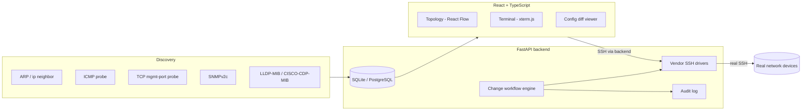

# Network Infrastructure Platform

A network discovery, topology-mapping, and controlled configuration-change
platform for authorized environments. It talks to real infrastructure over
real protocols -- SNMP, LLDP/CDP, SSH -- and is built around one core
distinction that most tools blur: **a device being visible on the network
does not mean it can be remotely configured.**

## The problem

Large networks become hard to operate by hand once you're dealing with
dozens or hundreds of switches, routers, and firewalls. This project handles
the pipeline from "what's out there" to "what did we verifiably change":

```
Discovery -> Identification -> Topology -> Management capability detection
   -> Authentication -> Monitoring -> Configuration -> Controlled changes
   -> Verification
```

## The core distinction: discovered vs. manageable

```
Device Console
      |
Console Server (optional, architected for -- see Limitations)
      |
SSH / Telnet / SNMP
      |
Platform
```

A device can be **discovered** (it answered ICMP, or an ARP entry exists for
it) without being **manageable**. The platform tracks this explicitly as a
`management_state` on every device:

```
DISCOVERED -> IDENTIFIED -> MONITORABLE -> REMOTELY_MANAGEABLE -> CONFIGURABLE
```

and a separate list of `available_management_methods` (`SSH`, `SNMP`,
`TELNET`, `HTTPS`, `CONSOLE`, `CONSOLE_SERVER`, `NONE`, ...). A device with
SNMP but no SSH shows up in the UI as monitorable-only, with its Terminal and
Configuration tabs explicitly disabled and explained -- never silently
faked. This is why every device detail view shows something like:

```
LEGACY-RTR01
Discovery:       yes (ARP, ICMP)
SNMP:            yes
SSH:             no
Remote management: CONSOLE ONLY
```

**Console-only handling:** the platform cannot reach a physical console port
over the LAN, and doesn't pretend to. What it *can* do -- and is architected
for, via the `CONSOLE_SERVER` management method -- is treat an
organization's console server (which exposes console ports over SSH/Telnet)
as just another SSH-reachable target. That integration itself is not yet
implemented; see Limitations.

## Architecture



Full layer breakdown: [`docs/architecture.md`](docs/architecture.md).

## Topology

Built **only** from observed evidence -- LLDP and CDP neighbor data pulled
over real SNMP walks, matched against already-known devices by management IP
or hostname. There is no seeded or hand-authored topology anywhere in the
codebase. Every edge carries the discovery method(s) that produced it and a
confidence score:

```
SW-CORE Gi1/0/1
        |
        | LLDP, confidence=0.98
        v
SW-ACCESS Gi1/0/48
```

See [`docs/topology.md`](docs/topology.md) for the confidence model and what
kinds of edges (MAC-table correlation, ARP inference) are architected for but
not yet populated.

## Supported vendors

| Vendor | Status |
|---|---|
| Cisco IOS / IOS-XE | Implemented: facts, interfaces, VLANs, CDP neighbors, config retrieval, apply, save, semantic rollback |
| MikroTik RouterOS | Implemented: facts, interfaces, VLANs, MNDP neighbors, config export, apply |
| Anything else reachable by SSH | Generic driver: raw command execution only; structured parsing explicitly `NOT IMPLEMENTED` |
| Juniper, Arista, Fortinet, Palo Alto, Aruba | **Not implemented.** The driver interface (`app/drivers/base.py`) is designed for this to be a contained addition -- see [`docs/drivers.md`](docs/drivers.md) |
| SNMPv3 | **Not implemented** -- SNMPv2c only |

## Security

- Credentials are Fernet-encrypted at rest and **never** returned by the API
  once stored.
- SSH host-key verification is on by default; disabling it requires an
  explicit `SSH_ALLOW_INSECURE_LAB_MODE=true` and is flagged in the audit
  log and the terminal itself.
- Every sensitive action is audited, with secret-shaped detail strings
  redacted before they reach the database.
- Discovery requires an explicit CIDR scope (no default/implicit range) and
  never does anything resembling port scanning -- only a fixed set of
  management ports are probed.
- Destructive commands (`reload`, `erase`, `write erase`, ...) are blocked
  at change-plan validation time, before any device is touched.

Full details: [`docs/security.md`](docs/security.md). This project does not
implement, and will not accept, offensive/unauthorized-access tooling --
see [`SECURITY.md`](SECURITY.md).

## Installation

### Option A: Download a release (recommended for just trying it out)

Pre-built, double-click-and-go packages for Linux and Windows are attached
to every [GitHub Release](../../releases) (built and tested on real Linux
and Windows CI runners -- see `.github/workflows/release.yml`):

- **Windows**: download `net-infra-platform-windows-x64-vX.Y.Z.zip`, extract
  it, run `net-infra-platform.exe`. Your browser opens automatically to
  `http://127.0.0.1:8000`. Windows SmartScreen may warn about an
  unrecognized publisher (the build isn't code-signed) -- "More info" ->
  "Run anyway".
- **Linux**: download `net-infra-platform-linux-x86_64-vX.Y.Z.tar.gz`,
  extract it, run `./net-infra-platform`.

Both are a single process that serves the API *and* the built frontend --
nothing else to install or configure. See `START-HERE.txt` inside the
archive for environment variables (port, host, data directory, disabling
auto-opening a browser tab).

### Option B: Docker

```bash
cp .env.example .env   # set SECRET_KEY and ENCRYPTION_KEY -- see comments in the file
docker compose up --build
```

Frontend on `http://localhost:8080`, API docs at `http://localhost:8000/docs`.
See [`docs/deployment.md`](docs/deployment.md) for why the backend runs with
`network_mode: host` and what to do if that doesn't suit your environment.

### Option C: Local development

**Linux / macOS:**
```bash
# backend
cd backend
python3 -m venv venv
source venv/bin/activate
pip install -e ".[dev]"
cp ../.env.example .env
alembic upgrade head
uvicorn app.main:app --reload

# frontend (separate terminal)
cd frontend
npm install
npm run dev
```

**Windows (PowerShell):**
```powershell
# backend
cd backend
python -m venv venv
venv\Scripts\Activate.ps1
# if activation is blocked: Set-ExecutionPolicy -Scope Process -ExecutionPolicy Bypass
pip install -e ".[dev]"
Copy-Item ..\.env.example .env
python scripts\generate_keys.py    # paste the printed SECRET_KEY / ENCRYPTION_KEY into .env
alembic upgrade head
uvicorn app.main:app --reload

# frontend (separate terminal)
cd frontend
npm install
npm run dev
```

**Windows (cmd.exe):** same as above but activate with `venv\Scripts\activate.bat`
instead of `Activate.ps1`.

**A note on discovery from Windows:** ARP (`arp -a`) and ICMP (`ping`) both
work natively on Windows -- `app/discovery/arp.py` and
`app/discovery/icmp.py` detect the OS and use the correct command syntax
and output parser for each (see `docs/discovery.md`). SSH, SNMP, and the
rest of the platform are pure-Python/socket-based and behave identically
on every OS.

## Building a release yourself

```bash
# Linux
./scripts/build_release_linux.sh          # -> release/net-infra-platform-linux-x86_64-vX.Y.Z.tar.gz

# Windows (PowerShell)
.\scripts\build_release_windows.ps1       # -> release\net-infra-platform-windows-x64-vX.Y.Z.zip
# or just double-click scripts\build_release_windows.bat
```

Both scripts build the frontend, run the full backend test suite (ruff,
mypy, pytest) as a release gate, then package a standalone executable via
PyInstaller (`backend/net-infra-platform.spec`) that bundles the built
frontend and serves it from the same process. Add `--publish` /
`-Publish` to also create and upload a GitHub Release via the `gh` CLI.
Pushing a `vX.Y.Z` tag triggers `.github/workflows/release.yml`, which runs
both scripts on real Linux and Windows GitHub Actions runners and attaches
the results to a GitHub Release automatically.

## Usage walkthrough

1. **Settings -> Discovery**: enter an authorized CIDR scope (e.g.
   `10.10.0.0/24`), optionally an SNMP community string, and start the job.
2. **Dashboard**: watch device counts and discovery job progress update from
   real probe results.
3. **Topology**: see the graph React Flow built from real LLDP/CDP evidence;
   edge color reflects confidence.
4. **Devices -> select a device**: see its real management-capability
   breakdown (SSH / SNMP / console-only).
5. **Settings -> Credential Profiles**: create an SSH credential profile,
   then assign it to a manageable device (`POST /devices/{id}/credentials`).
6. **Device -> Terminal**: open a real SSH terminal (only enabled if SSH was
   detected).
7. **Device -> Configuration**: retrieve the real running-config (secrets
   redacted for display), create a backup.
8. **Change Management -> New Change Plan**: propose configuration lines
   against one or more devices.
9. **Validate**: blocking/warning issues surface before anything touches a
   device.
10. **Preview**: see a predicted semantic diff, categorized (Interfaces,
    VLANs, Routes, ACLs, ...).
11. **Apply**: type your name to confirm; the platform backs up, applies over
    real SSH, and re-verifies by re-reading the device's config.
12. **Audit**: every step above is a queryable, timestamped record.

## Limitations

Being honest about these matters more than pretending they don't exist:

- **The Windows build (.exe / PyInstaller / `build_release_windows.ps1`)
  was developed and validated in a Linux-only environment.** The actual
  Windows-specific code paths -- `arp -a` parsing, `ping -n/-w` argument
  handling -- are covered by unit tests against captured real Windows
  command output, and the PyInstaller packaging approach itself was proven
  end-to-end (built, run, and hit with real HTTP requests) on Linux with
  the identical `.spec` file. But nobody has run
  `build_release_windows.ps1` on a physical Windows machine by hand during
  development. `.github/workflows/release.yml` runs it for real on a
  `windows-latest` GitHub Actions runner on every tagged release -- that CI
  run, not this sentence, is the actual proof it works. If you hit a
  Windows-specific issue, please open one.
- **SNMPv3 is not implemented** -- only SNMPv2c.
- **Some devices are discoverable but not manageable** -- this is by design,
  not a bug (see "The core distinction" above).
- **Console-only devices have no remote CLI path** unless a console server
  is configured, and console-server integration itself is architected for
  (`ManagementMethod.CONSOLE_SERVER`) but not yet implemented.
- **Rollback only works reliably for Cisco IOS** (`supports_semantic_rollback`).
  MikroTik and generic-SSH rollback report `UNAVAILABLE` rather than
  pretending to succeed.
- **The "predicted diff" shown at Preview time is a best-effort simulation**
  (block-level merge of proposed lines into the current config), not a real
  IOS command interpreter -- the authoritative diff is always recomputed
  from the device's actual post-apply config.
- **Discovery job cancellation is not cooperative mid-batch** -- a cancelled
  job's already-dispatched probes still complete; only the DB status updates
  immediately.
- **Topology edges come from LLDP/CDP only** today; MAC-table correlation
  and ARP-based inference (lower-confidence edge types the model supports)
  are not yet populated by any discovery routine.
- **SNMP capabilities vary by device** -- CPU/memory/temperature are polled
  best-effort and reported as `unavailable`, never fabricated, when a device
  doesn't expose them.

## Roadmap

- SNMPv3 (USM users, auth/priv protocols -- the credential model already has
  the fields)
- Additional vendor drivers (Juniper, Arista, Fortinet, Palo Alto, Aruba)
- Console-server-mediated management
- MAC-table and ARP-based inferred topology edges
- Cooperative discovery-job cancellation
- Batch change-plan progress streaming (currently synchronous per-device)

## Testing

```bash
cd backend
ruff check app tests
mypy app
pytest tests/ -v
```

72 tests, all passing, none requiring live production hardware. Notably:
`tests/fixtures/fake_ssh_device.py` is a **real** in-process SSH server
(genuine asyncssh transport, TCP, auth, PTY) with only the remote device's
command responses scripted -- this drives the driver integration tests. SNMP
integration tests hit a real closed UDP port to prove genuine network I/O
rather than mocking the transport. See [`docs/discovery.md`](docs/discovery.md)
and [`docs/drivers.md`](docs/drivers.md) for what each test layer proves.

```bash
cd frontend
npm run lint
npm run typecheck
npm run build
```

## Example data

`examples/fixtures/` contains sanitized example device records (a Cisco
Catalyst core switch, a Cisco IOS-XE edge router, a MikroTik CHR, and a
console-only legacy router) used in local development and screenshots --
never presented as real discovered infrastructure, and never loaded by
default.

## License

MIT -- see [`LICENSE`](LICENSE).
