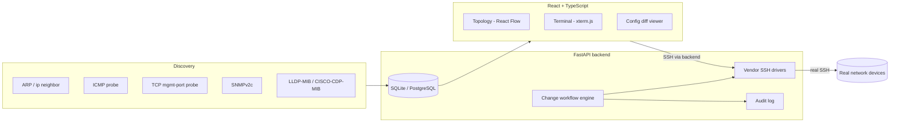

# Network Infrastructure Platform

> **Discover. Understand. Manage. Verify.**

A network discovery, topology-mapping, monitoring, and controlled configuration-change platform for authorized environments.

It talks to real infrastructure over real protocols — **SNMP, LLDP/CDP, SSH** — and is built around one core engineering distinction:

> **A device being visible on the network does not mean it can be remotely configured.**

[Quick Start](#quick-start) · [Architecture](#architecture) · [Security](#security) · [Documentation](#documentation) · [Releases](../../releases)

---

## Overview

Large networks become difficult to operate manually once you're dealing with dozens or hundreds of switches, routers, and firewalls.

This platform handles the workflow from:

```text
Discovery
   ↓
Identification
   ↓
Topology
   ↓
Management capability detection
   ↓
Authentication
   ↓
Monitoring
   ↓
Configuration
   ↓
Controlled changes
   ↓
Verification
```

The platform explicitly tracks whether a device is merely **discovered**, **monitorable**, or actually **remotely manageable/configurable**.

---

## Core distinction: discovered vs. manageable

A device can be discovered because it answers ICMP or appears in an ARP table without having any usable remote management path.

Each device therefore exposes a `management_state`:

```text
DISCOVERED
    ↓
IDENTIFIED
    ↓
MONITORABLE
    ↓
REMOTELY_MANAGEABLE
    ↓
CONFIGURABLE
```

It also records the available management methods, such as:

```text
SSH
SNMP
TELNET
HTTPS
CONSOLE
CONSOLE_SERVER
NONE
```

For example:

```text
LEGACY-RTR01
Discovery:          yes (ARP, ICMP)
SNMP:               yes
SSH:                no
Remote management:  CONSOLE ONLY
```

A device with SNMP but no SSH is shown as monitorable-only. Terminal and Configuration capabilities remain disabled rather than being simulated.

### Console-only handling

The platform cannot reach a physical console port over the LAN, and does not pretend to.

It is architected to support an organization's **console server** through the `CONSOLE_SERVER` management method, where the console server exposes console ports over SSH/Telnet. That integration is not yet implemented.

---

## Features

- 🔎 **Network discovery** — ARP, ICMP, fixed management-port probes, and SNMP
- 🗺️ **Evidence-based topology** — LLDP/CDP relationships with confidence information
- 📡 **Monitoring** — SNMP-backed device capability and telemetry collection
- 🔐 **Credential protection** — encrypted credentials and explicit management states
- 🖥️ **SSH management** — real terminal access when SSH is actually available
- ⚙️ **Configuration management** — retrieve, inspect, back up, and apply configuration
- 📋 **Change plans** — validate proposed changes before touching a device
- 🔀 **Semantic configuration diff** — categorized predicted and authoritative diffs
- 🔄 **Verification** — re-read device state after applying a change
- 📝 **Audit trail** — timestamped records of sensitive operations
- 🧩 **Vendor drivers** — Cisco IOS/IOS-XE, MikroTik RouterOS, plus a generic SSH driver

---

## Architecture



Full layer breakdown: [`docs/architecture.md`](docs/architecture.md).

---

## Topology

Topology is built from **observed evidence**, not seeded or hand-authored relationships.

Today, LLDP and CDP neighbor data is collected over real SNMP walks and matched against known devices by management IP or hostname. Every topology edge carries its discovery method(s) and a confidence score.

```text
SW-CORE Gi1/0/1
        |
        | LLDP, confidence=0.98
        v
SW-ACCESS Gi1/0/48
```

See [`docs/topology.md`](docs/topology.md) for the confidence model and planned lower-confidence inference methods.

---

## Supported vendors and protocols

| Vendor / Protocol | Discovery | Monitoring | SSH | Configuration | Rollback |
|---|:---:|:---:|:---:|:---:|:---:|
| Cisco IOS / IOS-XE | ✅ | ✅ | ✅ | ✅ | Semantic |
| MikroTik RouterOS | ✅ | ✅ | ✅ | ✅ | — |
| Generic SSH | — | — | ✅ | Raw commands | — |
| Juniper | — | — | — | — | — |
| Arista | — | — | — | — | — |
| Fortinet | — | — | — | — | — |
| Palo Alto | — | — | — | — | — |
| Aruba | — | — | — | — | — |
| SNMPv3 | — | — | — | — | — |

> The generic SSH driver supports raw command execution only. Structured parsing for additional vendors is not implemented.

The driver interface in `app/drivers/base.py` is designed to make additional vendor drivers a contained extension. See [`docs/drivers.md`](docs/drivers.md).

---

## Security

Security-sensitive behavior is explicit by design:

- Credentials are Fernet-encrypted at rest and are **never returned by the API** once stored.
- SSH host-key verification is enabled by default.
- Disabling host-key verification requires explicit `SSH_ALLOW_INSECURE_LAB_MODE=true` and is flagged in the audit log and terminal.
- Sensitive actions are audited, with secret-shaped detail strings redacted before database storage.
- Discovery requires an explicit CIDR scope; there is no implicit default range.
- Discovery does not perform general port scanning; only a fixed set of management ports is probed.
- Destructive commands such as `reload`, `erase`, and `write erase` are blocked during change-plan validation, before a device is touched.
- The project does not implement offensive or unauthorized-access tooling.

Full details: [`docs/security.md`](docs/security.md) and [`SECURITY.md`](SECURITY.md).

---

## Quick Start

### Windows — recommended for trying the platform

1. Download the latest **Windows x64** release from [GitHub Releases](../../releases).
2. Extract the ZIP archive.
3. Run `net-infra-platform.exe`.
4. Open `http://127.0.0.1:8000` if the browser does not open automatically.
5. Go to **Settings → Discovery**.
6. Enter an **authorized CIDR scope** and start discovery.

The release is a single process containing both the API and built frontend. No Python, Node.js, Docker, or separate services are required for the packaged release.

### Linux

1. Download the latest Linux x86_64 release.
2. Extract the archive.
3. Run `./net-infra-platform`.
4. Open `http://127.0.0.1:8000`.

See `START-HERE.txt` inside the release archive for environment variables and runtime options.

> **Windows SmartScreen:** the current Windows build is not code-signed, so Windows may display an “unrecognized publisher” warning. Only run a binary obtained from the official GitHub Release and verify its release artifact checksum before execution.

---

## Requirements

### Packaged release

- Windows 10/11 x64 **or** Linux x86_64
- No Python required
- No Node.js required
- No Docker required

### Development

- Python 3.11+
- Node.js / npm
- Git

---

## Installation

### Release packages

Pre-built packages for Linux and Windows are attached to every [GitHub Release](../../releases).

**Windows**

```text
net-infra-platform-windows-x64-vX.Y.Z.zip
```

Extract and run:

```text
net-infra-platform.exe
```

**Linux**

```text
net-infra-platform-linux-x86_64-vX.Y.Z.tar.gz
```

Extract and run:

```bash
./net-infra-platform
```

Both packages serve the API and built frontend from a single process.

### Docker

```bash
cp .env.example .env
# Set SECRET_KEY and ENCRYPTION_KEY as described in .env.example
docker compose up --build
```

Frontend: `http://localhost:8080`

API documentation: `http://localhost:8000/docs`

See [`docs/deployment.md`](docs/deployment.md) for deployment details, including the backend's `network_mode: host` requirement.

### Local development — Linux / macOS

```bash
cd backend
python3 -m venv venv
source venv/bin/activate
pip install -e ".[dev]"
cp ../.env.example .env
alembic upgrade head
uvicorn app.main:app --reload
```

In a second terminal:

```bash
cd frontend
npm install
npm run dev
```

### Local development — Windows PowerShell

```powershell
cd backend
python -m venv venv
venv\Scripts\Activate.ps1

# If activation is blocked:
Set-ExecutionPolicy -Scope Process -ExecutionPolicy Bypass

pip install -e ".[dev]"
Copy-Item ..\.env.example .env
python scripts\generate_keys.py
alembic upgrade head
uvicorn app.main:app --reload
```

In a second terminal:

```powershell
cd frontend
npm install
npm run dev
```

For `cmd.exe`, use `venv\Scripts\activate.bat`.

---

## Usage walkthrough

1. **Settings → Discovery** — enter an authorized CIDR scope, optionally configure an SNMP community string, and start discovery.
2. **Dashboard** — monitor device counts and discovery progress from real probe results.
3. **Topology** — inspect relationships derived from real LLDP/CDP evidence.
4. **Devices** — inspect each device's management capabilities.
5. **Credential Profiles** — create an SSH credential profile and assign it to a manageable device.
6. **Terminal** — open a real SSH terminal when SSH has actually been detected.
7. **Configuration** — retrieve the running configuration with secrets redacted for display and create a backup.
8. **Change Management** — create a proposed change plan for one or more devices.
9. **Validate** — inspect blocking and warning conditions before anything touches a device.
10. **Preview** — review the predicted semantic diff, categorized by areas such as interfaces, VLANs, routes, and ACLs.
11. **Apply** — explicitly confirm the change; the platform backs up, applies over real SSH, and re-verifies the device configuration.
12. **Audit** — review timestamped records of the workflow.

---

## Building a release

```bash
# Linux
./scripts/build_release_linux.sh
```

```powershell
# Windows PowerShell
.\scripts\build_release_windows.ps1
```

Or on Windows:

```text
scripts\build_release_windows.bat
```

The release scripts:

1. Build the frontend.
2. Run the backend quality gates: `ruff`, `mypy`, and `pytest`.
3. Package a standalone executable with PyInstaller.
4. Bundle the built frontend into the same process.

The PyInstaller specification is:

```text
backend/net-infra-platform.spec
```

To publish through the GitHub CLI, use the script's `--publish` / `-Publish` option.

Pushing a `vX.Y.Z` tag triggers `.github/workflows/release.yml`, which builds Linux and Windows release artifacts on GitHub Actions runners and attaches them to a GitHub Release.

---

## Testing

### Backend

```bash
cd backend
ruff check app tests
mypy app
pytest tests/ -v
```

The test suite covers discovery, SSH drivers, SNMP I/O, configuration workflows, and security-sensitive behavior.

The integration fixtures include a real in-process SSH server using genuine AsyncSSH transport, TCP, authentication, and PTY handling. SNMP integration tests exercise genuine UDP network I/O against a closed port rather than mocking the transport.

### Frontend

```bash
cd frontend
npm run lint
npm run typecheck
npm run build
```

---

## Current limitations

This project intentionally documents its boundaries rather than simulating unsupported capabilities.

- **SNMPv3 is not implemented** — SNMPv2c only.
- **Some devices are discoverable but not manageable** — this is a deliberate distinction, not an error.
- **Console-only devices have no remote CLI path** unless a console server is configured. Console-server integration is architected but not implemented.
- **Rollback is currently reliable only for Cisco IOS** through `supports_semantic_rollback`. MikroTik and generic-SSH rollback report `UNAVAILABLE`.
- **The predicted diff is a best-effort simulation** based on block-level merging of proposed lines. It is not a full IOS command interpreter. The authoritative diff is recomputed from the actual post-apply configuration.
- **Discovery cancellation is not cooperative mid-batch** — probes already dispatched continue to completion.
- **Topology currently uses LLDP/CDP evidence only**. MAC-table correlation and ARP-based inference are not yet populated by discovery routines.
- **SNMP capabilities vary by device**. CPU, memory, and temperature data are collected best-effort and reported as unavailable when the device does not expose them.
- **Windows-specific behavior is exercised by captured-output tests and Windows GitHub Actions CI**. The development environment used for the original implementation was Linux-only; tagged releases run the Windows packaging workflow on a real `windows-latest` runner.

---

## Roadmap

### Networking

- SNMPv3 with USM authentication/privacy protocols
- MAC-table topology correlation
- ARP-based inferred topology edges
- Cooperative discovery-job cancellation

### Management

- Console-server-mediated management
- Batch change-plan progress streaming

### Vendor support

- Juniper
- Arista
- Fortinet
- Palo Alto
- Aruba

---

## Example data

`examples/fixtures/` contains sanitized example device records used for local development and screenshots, including:

- Cisco Catalyst core switch
- Cisco IOS-XE edge router
- MikroTik CHR
- Console-only legacy router

These fixtures are not presented as real discovered infrastructure and are not loaded by default.

---

## Documentation

- [`Architecture`](docs/architecture.md)
- [`Topology`](docs/topology.md)
- [`Security`](docs/security.md)
- [`Discovery`](docs/discovery.md)
- [`Driver Development`](docs/drivers.md)
- [`Deployment`](docs/deployment.md)
- [`Security Policy`](SECURITY.md)
- [`License`](LICENSE)

---

## Contributing

Contributions should preserve the project's core principles:

- Do not fabricate discovery or device state.
- Keep management capabilities explicit.
- Do not introduce offensive or unauthorized-access functionality.
- Add tests for new discovery, driver, configuration, or security-sensitive behavior.
- Keep vendor-specific behavior isolated behind the driver interface where practical.

Before submitting a change:

```bash
# Backend
cd backend
ruff check app tests
mypy app
pytest tests/ -v

# Frontend
cd ../frontend
npm run lint
npm run typecheck
npm run build
```

---

## License

MIT — see [`LICENSE`](LICENSE).
