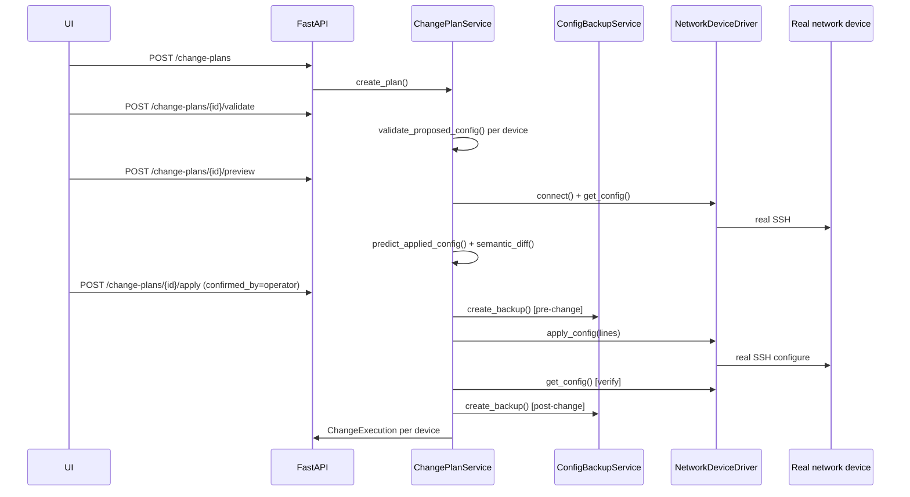

# Architecture

## Layered backend

```
app/
├── api/          FastAPI routers + Pydantic schemas + dependency wiring
├── discovery/    ARP/ICMP/TCP-probe/scope/identification -- finds devices
├── snmp/         Real pysnmp client, OIDs, facts, LLDP/CDP-over-SNMP
├── drivers/      Vendor SSH drivers (Cisco IOS, MikroTik RouterOS, generic)
├── topology/     Read-side graph service over stored Connection rows
├── configuration/ Backup, secret sanitization, semantic diff, validation
├── changes/      PLAN -> VALIDATE -> PREVIEW -> APPLY -> VERIFY -> ROLLBACK
├── credentials/  Fernet encryption + credential profile service
├── audit/        Redacted audit event logging
├── monitoring/   SNMP/ICMP health polling
└── db/           SQLAlchemy async models + session
```

Each layer only depends on layers below it in this list (`api` depends on
everything; `db` depends on nothing else in `app`). `discovery` and
`changes` are deliberately separate modules with no shared state --
discovering a device never implies it is manageable, and the code structure
enforces that by keeping "what did we observe" (discovery, topology) and
"what can we do about it" (drivers, changes) in different subsystems that
only communicate through the `Device.management_state` /
`available_management_methods` fields on the shared model.

## Request flow for a configuration change



## Why this topology library: React Flow

The frontend uses **React Flow** for the topology view. It was chosen over
Cytoscape.js because: it's a first-class React component (state, not an
imperative wrapper), it has native support for custom node styling driven by
device-type data without a separate stylesheet DSL, built-in pan/zoom/
minimap/controls out of the box, and a smaller bundle than Cytoscape's
plugin ecosystem for this use case (we don't need Cytoscape's graph-theory
algorithms -- layout here is intentionally simple, grouped-by-device-type,
since the confidence-scored edges are the point, not a force-directed
layout).

## Database

SQLite by default (zero-config, works out of the box per the project
requirements); the code is Postgres-compatible because every query goes
through SQLAlchemy's async ORM with no SQLite-specific SQL. Swapping
`DATABASE_URL` to a `postgresql+asyncpg://` DSN is the only change needed
for a multi-operator deployment. See `backend/alembic/` for the migration
scaffold (models are also auto-created via `Base.metadata.create_all` in
non-production environments for zero-friction local dev).
